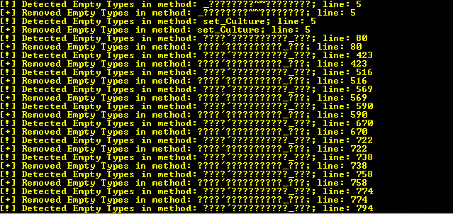

# AutoriDeobfuscator
.NET Deobfuscator for AutoriObfuscator (NeonFusactor)

# Features
it removes:
- Numeric Encryption
- String Encryption
- Constant Melter
- Constructor Decomp
- Empty Types
- Anti Decompiler
- Constant Hider
- AntiTamper
- Anti De4dot

# Usage
- 1.Open the compiled Application
- 2.Insert target Assembly path
- 3.Click on Enter key
- ->output: ...-cleaned.exe

